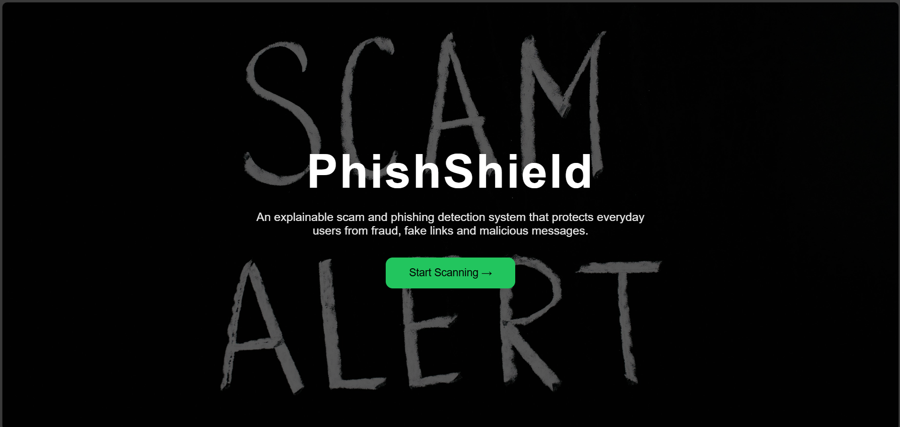
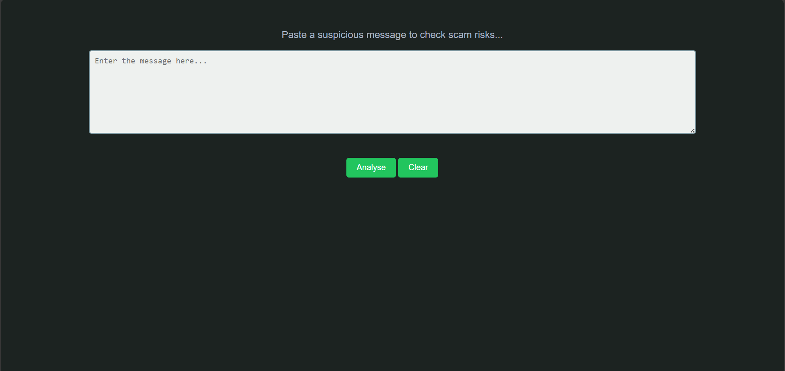
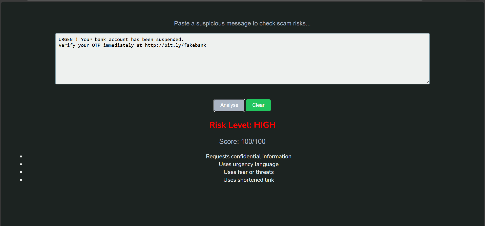

# PhishShield 
### Explainable Scam & Phishing Detection System

---

# Basic Details

## Team Name
Team Duo

## Team Members
- Member 1: Arniteja Vijay – Govt. Engineering College Kozhikode
- Member 2: K R Kavana – Govt. Engineering College Kozhikode

---

# Hosted Project Link

Live website:
Source Code:

---

# Project Description
PhishShield is a lightweight web application that detects scam and phishing messages using keyword analysis, link risk detection, and an explainable risk scoring system.  
It helps non-technical users understand *why* a message is dangerous instead of just blocking it.

---

# The Problem Statement
Digital fraud cases like phishing, OTP scams, UPI fraud, and fake job offers are rapidly increasing.  
Most existing tools are built for technical users and provide unclear warnings that common people ignore or misunderstand.

---

# The Solution
PhishShield allows users to paste suspicious messages and instantly:

- Calculate scam probability score
- Detect malicious or shortened links
- Highlight risky language
- Provide clear explanations
- Give voice alerts for accessibility

This makes scam detection simple, explainable, and user-friendly.

---

# Technical Details

## Technologies/Components Used

### For Software:
- Languages used: HTML, CSS, JavaScript
- Frameworks used: None 
- Libraries used: Web Speech API
- Tools used: VS Code, Git, GitHub Pages

### For Hardware:
Not applicable

---

# Features

- Feature 1: Scam keyword detection (urgency, fear, reward bait, sensitive info)
- Feature 2: Hazardous link detection (short URLs, risky domains, IP links)
- Feature 3: Risk scoring system (Low / Medium / High)
- Feature 4: Voice alert for accessibility
- Feature 5: Modern responsive UI
- Feature 6: Background carousel landing page

---

# Implementation

## For Software:

### Installation
No installation required

### Run
Simply open:
index.html

in any browser

---

# Project Documentation

## Screenshots

  
Landing page with background carousel and project introduction

  
Main analyzer interface where users paste suspicious messages and links

  
Risk score and explainable detection results

---

# Diagrams

## System Architecture

User → Web Interface → Text Analyzer → Keyword & Link Scanner → Risk Score Engine → Result + Voice Output

---

## Application Workflow

1. User pastes suspicious message and links
2. System scans keywords and URLs  
3. Calculates risk score  
4. Displays explanation  
5. Optional voice alert  

---

# Additional Documentation

## For Web Projects with Backend:
Not applicable (frontend-only static app)

---

# Project Demo

## Video
(Add your YouTube/Drive demo link here)

Demonstrates:
- Home page
- Message analysis
- Risk detection
- Voice alerts
- UI flow

---

# AI Tools Used (Optional - Transparency Bonus)

Tool Used: ChatGPT , Github Copilot
Purpose: Code structure guidance, debugging help, UI improvements  
Examples:
- Generated scoring logic
- Helped debug JavaScript issues
- Suggested UI enhancements  

Percentage of AI-generated code: ~20%-30%  
Human Contributions:
- Project design
- Logic implementation
- UI/UX building
- Testing and integration

---

# Team Contributions

Arniteja Vijay:
- Frontend UI design
- Keyword detection logic
- Link risk analysis
- Deployment

K R Kavana:
- Testing
- Documentation
- Feature improvements
- Demo preparation

---

# License
This project is licensed under the MIT License.
